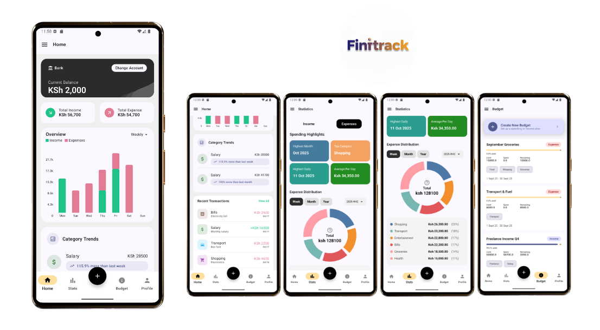

# 💰 Fintrack KMP — Personal Finance & Expense Tracker

**Fintrack KMP** is a modern **cross-platform finance tracking app** built with **Kotlin Multiplatform (KMP)**, designed to share business logic across **Android** and **iOS** while providing native, polished user experiences on each platform. It connects to the [Fintrack Ktor Backend](https://github.com/markgithinji/Fintrack-ktor) for secure data synchronization and API communication.

It allows users to **track income, expenses, and balances**, visualize **financial insights**, and manage their money efficiently.

> 🧠 **Note:** Fintrack KMP is 90% done and is still **a work in progress** and relies on the [Fintrack Ktor Backend](https://github.com/markgithinji/Fintrack-ktor) for API communication.

---

## 🚀 Tech Stack

**Cross-Platform Core:**
- **Kotlin Multiplatform**: Shared business logic across Android & iOS
- **KMP Architecture**: Clean Architecture + MVVM
- **Dependency Injection**: Koin
- **Networking**: Ktor Client + Kotlinx Serialization
- **Asynchronous**: Kotlin Coroutines + Flow
- **Pagination**: Paging 3

**Android UI Layer:**
- **UI**: Jetpack Compose, Material 3
- **Secure Storage**: Encrypted Preferences

**iOS UI Layer:**
- **UI**: SwiftUI
- **Secure Storage**: Keychain

**Development & Quality:**
- **Testing**: Unit Tests, ViewModel Tests, UI Tests (WIP)
- **CI/CD**: GitHub Actions (WIP)
- **Code Quality**: Detekt, Spotless

---

## 💡 Core Features

- **Multi-Account Management**: Track balances across checking, savings, credit cards, and cash
- **Smart Budget Planning**: Set monthly budgets with category-wise limits and spending alerts
- **Income & Expense Tracking**: Monitor cash flow with daily, weekly, and monthly period views
- **Category-based Analytics**: Visual breakdown of spending by categories (food, transportation, entertainment, etc.)
- **Interactive Charts**: Beautiful visualizations for spending patterns, income trends, and budget compliance
- **Transaction History**: Comprehensive ledger with search, filter, and export capabilities
- **Financial Highlights**: Key insights showing top expenses, savings rate, and financial health metrics
- **Secure Authentication**: Encrypted token storage

---

## 📸 Screenshot

  

*Main dashboard showing account balances, trends, budgets, stats&summaries and recent transactions*

---

## 🚧 In Progress

- 🚧 iOS SwiftUI integration
- 🚧 Testing
- 🚧 Code cleanups
- 🚧 Biometric support

---

## ⚙️ Requirements

- Kotlin 2.x
- Android Studio Giraffe or newer
- Xcode 15+ (for iOS module)
- [Fintrack Ktor Backend](https://github.com/markgithinji/Fintrack-ktor) server

---

## 🔗 Backend Integration

This app connects to the [Fintrack Ktor Backend](https://github.com/markgithinji/Fintrack-ktor) which provides:
- **RESTful API** for all financial operations
- **JWT Authentication** with secure token management
- **PostgreSQL Database** for data persistence
- **Real-time synchronization** across devices
- **Financial analytics** and reporting endpoints

---

## 🎯 Project Highlights

Fintrack KMP demonstrates:
- **Production-ready KMP architecture** with shared ViewModels
- **Seamless backend integration** using Ktor Client
- **Secure cross-platform storage** solutions
- **Modern declarative UIs** on both platforms
- **Comprehensive testing strategy** with dependency injection
