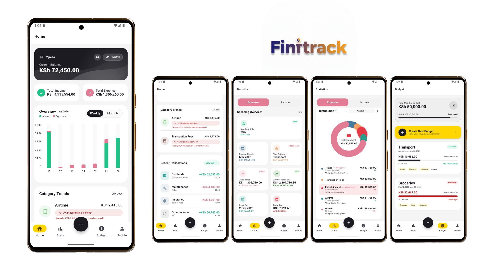

# 💰 Fintrack KMP — Personal Finance & Expense Tracker

**Fintrack KMP** is a modern **cross-platform finance tracking app** built with **Kotlin Multiplatform (KMP)**, designed to share business logic across **Android** and **iOS** while providing native, polished user experiences on each platform. It connects to the [Fintrack Ktor Backend](https://github.com/markgithinji/Fintrack-ktor) for secure data synchronization and API communication.

It allows users to **track income, expenses, and balances**, visualize **financial insights**, and manage their money efficiently.

> 🧠 **Note:** Fintrack KMP is 90% done and is still **a work in progress** and relies on the [Fintrack Ktor Backend](https://github.com/markgithinji/Fintrack-ktor) for API communication.

---

## 📸 Screenshot

  

*Main dashboard showing account balances, trends, budgets, stats&summaries and recent transactions*

---

## 🚀 Tech Stack

**Cross-Platform Core:**
- **Kotlin Multiplatform**: Shared business logic across Android & iOS
- **KMP Architecture**: Clean Architecture + MVVM
- **Dependency Injection**: Koin
- **Networking**: Ktor Client + Kotlinx Serialization
- **Asynchronous**: Kotlin Coroutines + Flow
- **Pagination**: Paging 3

**Android UI Layer:**
- **UI**: Jetpack Compose, Material 3
- **Background Processing**: WorkManager (Expedited Sync)
- **Secure Storage**: Encrypted Preferences
- **Security**: Android Biometric Library

**iOS UI Layer:**
- **UI**: SwiftUI
- **Secure Storage**: Keychain
- **Security**: LocalAuthentication (FaceID/TouchID)

**Development & Quality:**
- **Testing**: Unit Tests, ViewModel Tests, UI Tests (WIP)
- **CI/CD**: GitHub Actions (WIP)
- **Code Quality**: Detekt, Spotless

---

## 💡 Core Features

- **Multi-Account Management**: Track balances across checking, savings, credit cards, and cash
- **Smart Category Trends**: Features a "Historical Look-back" system that automatically discovers and displays your last active month's trends if the current month is empty. Includes dual-level comparisons (Monthly vs. Weekly) with context-aware wording.
- **Smart Budget Planning**: Set monthly budgets with category-wise limits. Includes **real-time threshold alerts** (50%, 80%, 100%) to keep your spending in check.
- **Automated Bill Reminders**: Intelligent backend engine that detects recurring subscriptions and bills from your history and automatically schedules local reminders before they are due.
- **Daily & Weekly Summaries**: Stay informed with scheduled push notifications summarizing your previous day's or week's total spending, helping you maintain financial awareness.
- **Income & Expense Tracking**: Monitor cash flow with daily, weekly, and monthly period views
- **Category-based Analytics**: Visual breakdown of spending by categories (food, transportation, entertainment, etc.)
- **Interactive Charts**: Beautiful visualizations for spending patterns, income trends, and budget compliance
- **Transaction History**: Comprehensive ledger with search, filter, and export capabilities
- **Flexible Data Export**: Export your transaction history in multiple formats (**CSV, PDF, or JSON**) with support for **custom date ranges**. Choose your preferred format in settings for a personalized export experience.
- **Financial Highlights**: Key insights showing top expenses, savings rate, and financial health metrics
- **Global Currency Preferences**: Seamlessly switch between multiple currencies (USD, KES, EUR, etc.) with real-time UI updates across the entire application.
- **Biometric Security**: Protect your financial data with **Fingerprint, FaceID, or TouchID** lock, ensuring privacy even if your device is unlocked.
- **Secure Password Management**: Update your account password directly from the app with real-time validation and secure backend synchronization.
- **Secure Authentication**: Encrypted token storage with automated token refresh and validation.
- **Daily Reminders**: Never forget to log an expense with customizable daily push notifications scheduled via high-reliability background receivers.
- **Smart SMS Detection (Android)**: Real-time M-Pesa transaction tracking via SMS. Provides **immediate UI notifications** upon receipt and uses **Expedited WorkManager** for guaranteed, high-priority background synchronization with the backend.

---

## ✨ Polished UI & Animations

Fintrack KMP prioritizes a fluid user experience with high-quality animations and transitions:

- **Shared Element Transitions**: Seamlessly morph UI elements (like transaction cards and headers) across screens using the latest Compose Shared Transition API for a continuous visual flow.
- **Interactive Visualizations**: Animated donut charts and progress indicators that respond to user selection with smooth, interpolated transitions.
- **Dynamic Theming**: Real-time UI color shifts between Income (Green) and Expense (Pink) modes, providing immediate visual context during data entry.
- **Reactive Currency Switching**: Instantly update all financial data displays across the app using Compose `CompositionLocal` and reactive flows when preferences change.
- **Intelligent Loading States**: Custom shimmer effects and staggered item animations that prevent layout shifts and provide a premium feel during data fetching.
- **Micro-interactions**: Subtle scale animations on chips, bouncy button presses, and `AnimatedContent` for text changes that make the app feel alive and responsive.

---

## 🚧 In Progress

- 🚧 iOS SwiftUI integration
- 🚧 Testing
- 🚧 Code cleanups

---

## ⚙️ Requirements

- Kotlin 2.x
- Android Studio Giraffe or newer
- Xcode 15+ (for iOS module)
- [Fintrack Ktor Backend](https://github.com/markgithinji/Fintrack-ktor) server

---

## 🔗 Backend Integration

This app connects to the [Fintrack Ktor Backend](https://github.com/markgithinji/Fintrack-ktor) which provides:
- **RESTful API** for all financial operations
- **JWT Authentication** with secure token management
- **PostgreSQL Database** for data persistence
- **Smart Recurring Engine**: Automated pattern detection for recurring payments and bill prediction.
- **Real-time synchronization** across devices
- **Financial analytics** and reporting endpoints

---

## 🎯 Project Highlights

Fintrack KMP demonstrates:
- **Production-ready KMP architecture** with shared ViewModels
- **Seamless backend integration** using Ktor Client
- **Secure cross-platform storage** solutions
- **Modern declarative UIs** on both platforms
- **Comprehensive testing strategy** with dependency injection
